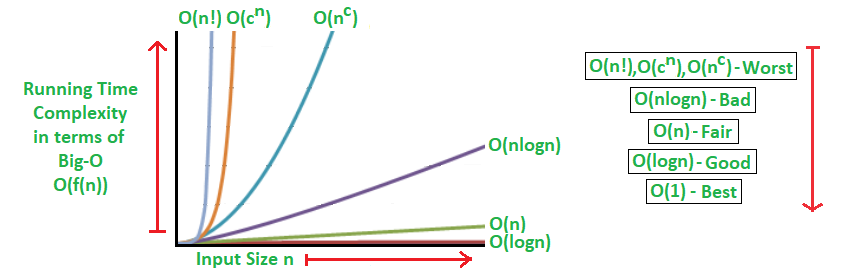
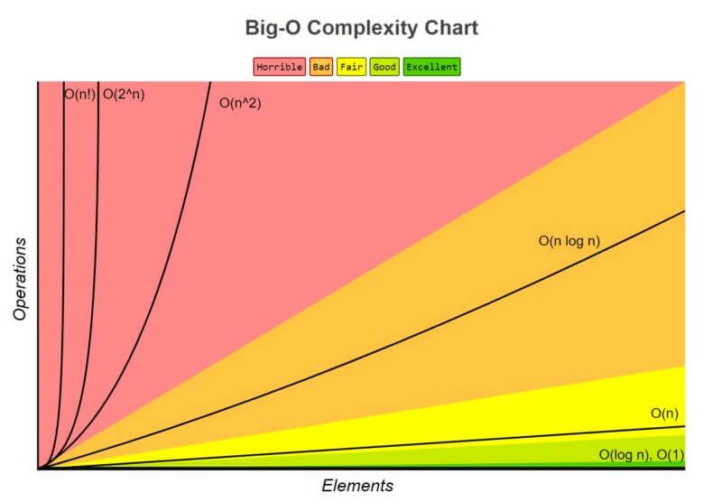

What is the need for Complexity Analysis ? 
- Which approach is better ? 
- Why care about identifying which is better ? 
- What does better mean ?
=> fast -> time complexity
=> less memory -> space complexity

What is Time Complexity ? 

what is asympotic analysis ? 
!
